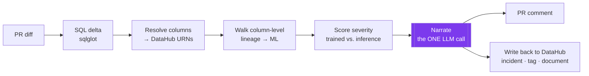

# Blastradar

**Blastradar is a CI agent that reviews data pull requests and tells you which
production ML models a schema change is about to silently break** — using DataHub's
column-level lineage to trace the blast radius from a dropped column all the way down
to the models trained on it.

## The problem

Dropping or renaming a column in a SQL/dbt model doesn't throw an error. The feature
pipeline downstream keeps running and silently emits nulls or stale values, so a
production model degrades for weeks before anyone connects it back to the "harmless"
cleanup PR that caused it. The person reviewing that PR has no way to see, at review
time, that a column they're deleting is what a deployed churn model was trained on.

## What a reviewer sees

Open a PR that drops `customers.customer_since`, and Blastradar posts this back on the
PR within seconds — *before* merge:

```text
### ⚠️ ML blast radius: 2 critical, 3 medium

This PR drops `customers.customer_since`, which feeds 5 downstream ML model(s) — the
change will not raise an error, so the impact is silent.

🔴 critical — churn_model_v3  (owner: @ml-platform · tags: Tier1)
  Deployment: churn_model_v3-prod (IN_SERVICE), churn_model_v3-canary (IN_SERVICE)
  Training:   trained on the changed column
  Path:       customers.customer_since → days_since_signup → churn_model_v3
  → Trained on this column AND serving live predictions. Dropping it doesn't fail the
    pipeline; the feature silently emits nulls, so predictions degrade with no error.
  Why critical: active deployment AND trained on the changed column; +tag Tier1

🔴 critical — reactivation_model_v1  (owner: @growth-ml)
  Deployment: reactivation_model_v1-prod (IN_SERVICE) …   Training: reads it at inference only
  Path:       customers.customer_since → days_since_signup → reactivation_model_v1

  … 🟡 3 medium — trained on the column but not currently deployed
     (full report: examples/impact-critical-trained-on.md)

### 📋 Write-back to DataHub
Wrote findings back to DataHub Core: an incident + a `pending-upstream-change` tag on
each critical/high model, and one knowledge-base document with the full report.
```

The whole point is the line **"trained on the changed column."** Blastradar
distinguishes a model that was *trained* on the column (drop it and the model is
quietly wrong) from one that only *reads* it at inference — a distinction no generic
lineage view gives you. Three real sample reports — a critical trained-on hit, a
medium non-deployed hit, and a clean no-impact PR — live in
[`examples/`](examples/README.md).

## Try it in 60 seconds

No DataHub, no network, no API key. Runs the real pipeline against recorded fixtures.
Needs **Python 3.11 or 3.12** (CI runs both; 3.13+ is untested — the pinned DataHub SDK
may lag) and **GNU make**:

```sh
python3.12 -m venv .venv && .venv/bin/pip install -e ".[dev]"   # or python3.11
make demo        # prints the PR comment above; completes in ~2s
```

`make test` runs the whole suite the same way (offline — the recorded fixtures double
as the tests).

<details><summary><b>Windows, or no <code>make</code></b></summary>

On Windows the venv lives under `.venv\Scripts\` (not `.venv/bin/`), and you must set
`PYTHONUTF8=1` so the emoji-bearing report can print to the console. Without `make`, run
the two targets directly — they are just the venv Python:

```powershell
python3.12 -m venv .venv
.venv\Scripts\pip install -e ".[dev]"
$env:PYTHONUTF8=1
.venv\Scripts\python -m pytest -q                        # == make test
.venv\Scripts\python scripts\demo.py --scenario critical  # == make demo
```
</details>

## How it works

Blastradar is **one deterministic pipeline with a single LLM call at the very end.**



Everything left of *Narrate* is plain Python calling DataHub in a fixed algorithm: the
lineage traversal and the impact/severity decisions are fully deterministic. The LLM
is called **exactly once**, at the end, handed the already-resolved impact graph, and
asked only to write prose and suggest a migration — it **never decides what is
impacted**, and it structurally can't (the report template slots its prose into a
pre-scored, pre-ordered list keyed by asset id).

Why this split: a judge (or a reviewer) runs this once and needs the same answer every
time. An agent looping over graph traversal is not reproducible, and a
non-deterministic impact report reads as broken. So the part that must be correct is
code, and the LLM only does the part it's actually good at — language.

That single narration call picks its provider at runtime: **Groq** (OpenAI-compatible,
default `llama-3.3-70b-versatile`) when `GROQ_API_KEY` is set, otherwise **Anthropic**
`claude-opus-4-8` when `ANTHROPIC_API_KEY` is set — Groq wins if both are present. With
neither key (or on `--no-llm`, or any API error), a fully-templated narration takes over,
so the tool still produces the same structured comment with no LLM at all.

More detail in [`docs/ARCHITECTURE.md`](docs/ARCHITECTURE.md).

## The full loop against a real DataHub

The offline demo above proves the pipeline; this runs it end-to-end against a live
DataHub and actually writes the findings back. Needs Docker.

```sh
make demo-live
```

That one command stands up DataHub's docker stack, waits for health, ingests the
ecommerce sample data, seeds the demo ML graph, and runs Blastradar with write-back
on. To run the CLI yourself against an existing DataHub:

```sh
cp .env.example .env            # set DATAHUB_GMS_URL (+ token if auth is on)
export TOOLS_IS_MUTATION_ENABLED=true
blastradar analyze \
  --changes demo-repo/demo-pr.json \
  --pr-repo order-entry/analytics --pr-number 42 \
  --no-post-comment             # drop this in CI to post the PR comment
```

> **⚠️ `TOOLS_IS_MUTATION_ENABLED=true` is required for write-back.** DataHub mutations
> are OFF by default. Without this exact variable, Blastradar still analyzes and
> comments, but writes nothing back — and the comment says so. **This is the #1 setup
> gotcha: if incidents aren't appearing in DataHub, this variable is unset.**
> `make demo-live` sets it for you. In CI, set it as an Actions *variable* (see
> [`.github/workflows/blastradar.yml`](.github/workflows/blastradar.yml)).

## How it uses DataHub

Blastradar is built entirely on **DataHub Core (open source)** — no Cloud-only
features on the critical path. Specifically:

- **Column-level lineage** is the core traversal primitive. It calls the experimental
  SDK's `DataHubClient.lineage.get_lineage(source_urn, source_column, direction,
  max_hops)` and reads `LineageResult.paths[].column_name` to propagate the *exact*
  changed column downstream — not just table-to-table edges.
- **ML entities** are read as aspects via `DataHubGraph.get_aspect`:
  `MLModelPropertiesClass` (a model's `mlFeatures`, `deployments`, `trainingJobs`,
  `groups`), `MLFeaturePropertiesClass` (feature `sources` + the exact source column
  recorded in `customProperties`), and `MLModelDeploymentPropertiesClass` (deployment
  `status`, to tell serving from shelved). Terminals are `mlFeatureTable`, `mlModel`,
  and `mlModelDeployment`.
- **Training-run provenance** is what powers the trained-vs-inference distinction. Each
  model's training run is a `dataProcessInstance`; Blastradar reads its
  `DataProcessInstanceInputClass` inputs and checks whether the *changed dataset* was
  among them. If yes, the model was trained on it (critical); if the model only
  consumes the feature at serving time, it's inference-only.
- **Write-back** uses DataHub Core primitives only: an **incident**
  (`IncidentInfoClass` emitted on a deterministic URN via `emit_mcp`, so re-runs are
  idempotent), a **tag** (`GlobalTagsClass`, `pending-upstream-change`, set-unioned
  with existing tags), and a saved **document** (`Document.create_document`, linking
  every impacted model). No assertions, contracts, or health-dashboard.
- **Schema + resolution** use `DataHubGraph.get_schema_metadata` (to expand `SELECT *`
  and validate columns) and `get_urns_by_filter` (to resolve a model name to a dataset
  URN, returning *all* candidates as `AMBIGUOUS` rather than guessing).

Every signature Blastradar depends on is recorded, with how it was verified, in
[`docs/API-NOTES.md`](docs/API-NOTES.md).

## Also in this repo

- [`skills/datahub-ml-impact/`](skills/datahub-ml-impact/) — a **DataHub Skill** that
  wraps this library so you can ask, interactively, *"what ML breaks if I change this
  column?"* Prepared as an upstream contribution to
  [`datahub-project/datahub-skills`](https://github.com/datahub-project/datahub-skills).
- [`contrib/ml-showcase/`](contrib/ml-showcase/) — the seeded ML graph packaged as a
  reusable **`ml-showcase` datapack**. None of DataHub's sample datasets ship ML
  entities; this fills that gap. Prepared as a second upstream contribution.

## Limitations & future work

Honesty over overclaiming:

- **Demo-graph depth is a deliberate scope choice.** The bundled graph is deliberately
  shallow — one column → one feature → five models → deployments, a single direct
  column → feature → model path — which keeps the offline `make demo` fast, deterministic,
  and dependency-free. The traversal engine itself is more general: a deterministic
  breadth-first walk with a configurable hop cap and a cycle guard that de-duplicates
  entities while keeping every distinct path to a terminal. The test suite verifies the
  multi-hop traversal and hop cap (`test_hop_cap_blocks_deep_terminal`) and cycle
  termination on dataset-to-dataset column lineage (`test_cycle_safety_terminates`); the
  multiple-distinct-paths-to-one-model case (a "diamond") is preserved by construction but
  is not exercised by the bundled graph or asserted by a dedicated test. The demo graph
  also carries no `transformOperation`/query text (the ecommerce sample has none), so
  per-hop SQL isn't shown. Deepening the graph to dramatize these paths was descoped for
  the hackathon timeframe — and loading a richer base locally is currently blocked on
  Windows by a DataHub datapack-loader bug (`KeyError: 'Did not find a registered class
  for c'`, [datahub#11107](https://github.com/datahub-project/datahub/issues/11107)).
- **SDK lineage crashes on non-dataset downstreams.** `datahub.sdk`'s `get_lineage`
  raises `InvalidUrnError` when a dataset has a **chart** downstream (it parses the
  chart URN as a dataset). Affected columns can't currently be walked; Blastradar
  degrades them to an explicit "incomplete" result, never a false all-clear. Fix:
  skip non-dataset lineage rows in the client wrapper, or track an SDK fix.
- **Incidents anchor on the changed dataset, not the model.** This GMS build rejects
  `mlModel` URNs as an incident destination (`not a valid destination`), so the
  incident is opened on the changed *dataset* with the affected model named in the
  title/body. The document, whose `related_assets` *do* accept model URNs, links each
  model directly.
- **Ownership escalates only on a live deployment.** A Tier1/Critical tag escalates
  severity one level on its own. Ownership does *not*: it escalates only when the model
  also has an active deployment. Ownership alone is near-universal on production models,
  so treating it as an independent escalator fired on almost every asset and collapsed
  HIGH into CRITICAL, drowning out the trained-vs-inference distinction. The remaining
  consequence is deliberate but worth knowing: a **deployed, inference-only, owned** model
  still reaches critical (`reactivation_model_v1` in the demo). Every escalation is
  traceable in the `reasons` on each finding.
- **PR posting validated against a mock GitHub API** (no live github.com remote in the
  build env); the real list/POST/PATCH calls run through the actual httpx path.
- **Feature `sources` are dataset-granular** in this GMS (it rejects schemaField URNs on
  `/sources/*`), so column precision into features is recovered from a
  `blastradar.source_column` custom property rather than a native column edge.

## How this was built

Blastradar was built with AI-assisted development (Claude Code) as part of an AI agent
hackathon — using agentic tooling to build an agent is the point of the event, not
something to hide. The author directed the architecture and every consequential design
decision: the deterministic-core / single-LLM-narration split, the column-level lineage
traversal, the trained-on-vs-inference severity distinction, and the two-tier
reproducibility setup. The DataHub integration and the core traversal logic were designed
against verified SDK behavior and covered by 74 tests, not blindly generated.

## License

[Apache 2.0](LICENSE).
